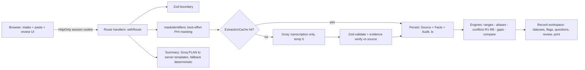

# MedLens — AI-Powered Clinical Information Intelligence

MedLens turns fragmented medical information — an intake form, a lab report —
into a **structured, source-cited, human-reviewable patient record**. Every
number can be traced to the text it came from, and the AI is never allowed to
be the doctor. It organizes and explains; it never diagnoses, prescribes, or
ranks clinical significance.

- **Stack:** Next.js 16 (App Router, TypeScript strict) · Tailwind · Zod ·
  Prisma/PostgreSQL · Groq (`openai/gpt-oss-120b`) · Vitest · Cloud Run (Docker)
- **Status:** 93 unit tests green · production build green · 11 routes

---

## Problem-statement requirements → implementation → proof

| PS requirement | Where implemented | Proof |
|---|---|---|
| Patient intake (age, sex, symptoms, conditions, allergies, medications) | `src/components/IntakeForm.tsx` · `src/lib/validation/request.ts` (Zod) · `src/lib/server/repo.ts` (`createRecordFromIntake`) | Build + Zod-boundary errors surfaced in UI |
| Medical report processing | `src/app/api/records/[id]/sources/route.ts` → `src/lib/server/extract.ts` | Cache-hit path: same text = 0 AI calls |
| Structured medical record (not a raw AI dump) | `src/app/record/[id]/page.tsx` (typed fact tables per kind) | Server-rendered tables; AI never writes UI structure |
| Reference-range awareness — low/normal/high, **never invent ranges** | `src/lib/engines/ranges.ts` (`parseRangeText`, `computeStatus`) | `tests/unit/ranges.test.ts` — 55 cases incl. `no_reference_provided` when the source has no range |
| Source & provenance (user vs AI) | `Fact.origin` (`user`/`ai`/`heuristic`) · `OriginChip` in record UI | Every row displays its origin + verification state |
| AI-powered summary without diagnosis | `src/lib/ai/summary.ts` (plan-and-template) · `src/app/api/records/[id]/summary/route.ts` | Templates render every sentence; invalid plan → deterministic fallback; no regeneration loop |
| Conflict & inconsistency detection | `src/lib/engines/conflicts.ts` (rules R1–R8, each citing both sides) | `tests/unit/conflicts.test.ts` — one test per rule + negative cases |
| Context-aware clarification questions | `src/lib/engines/gaps.ts` | `tests/unit/gaps.test.ts` — trigger-cited, capped at 5 |
| Human verification & editing | `PATCH /api/records/[id]/facts/[factId]` · `ReviewButtons.tsx` | Revision-checked (409 on stale) + audit entry per change |
| Comparison of current vs previous reports | `src/lib/engines/compare.ts` · `GET /api/records/[id]/compare` | Unit conversion (exact factors only); incompatible units reported honestly |
| Persistent history | `listRecords` · home page history list | Owner-scoped: cross-session reads structurally impossible |
| Auth & access control | `src/lib/server/session.ts` + `repo.ts` (every query takes `sessionId`) | Opaque token; DB stores only SHA-256; no passwords in scope (stated) |
| Timelines & audit history | `AuditEvent` model · audit section on record page | Append-only; before/after JSON per correction |
| PDF export / print | `src/app/record/[id]/print/page.tsx` | Print-CSS one-pager: coverage meter, provenance, disclaimer |
| Confidence / verification indicators | `Fact.verified` + quarantine styling | Unverifiable rows are quarantined — visible, excluded from summaries, never silently dropped or trusted |

## Safety architecture (the core idea)

1. **The model is an untrusted sensor.** Groq only transcribes rows
   (temperature 0, JSON mode) and plans summaries
   (`{sections, note≤140}`). All classification, range parsing, conflict
   rules and summary text are **pure, server-owned, unit-tested** code in
   `src/lib/engines/*` (zero AI imports — provable by grep).
2. **Evidence or quarantine.** Every extracted row must match its quoted
   source line verbatim (`src/lib/server/evidence.ts`) or it is quarantined.
   Invented reference ranges are structurally rejected, not asked-away.
3. **Plan-and-template summaries.** The model plans; the server writes every
   sentence from audited templates. Unsafe phrasing is structurally impossible.
4. **Least data egress.** Best-effort identifier masking
   (`src/lib/ingest/masking.ts`) before any bytes reach the model; content-hash
   extraction cache (`ExtractionCache`) means re-uploads cost **0 AI calls**.
5. **Degraded mode.** If the provider fails, a regex extractor
   (`src/lib/engines/regex.ts`) handles classic `Name Value Unit Range` lines,
   marked `origin: heuristic`, quarantined.


## Security model

- **Sessions, not passwords.** Opaque 256-bit token in an `HttpOnly; Secure;
  SameSite=Lax` cookie; only its SHA-256 is stored. This is *access isolation*,
  not identity verification — stated plainly.
- **Owner-scoped repository.** Every DB query takes `sessionId`; cross-session
  reads are structurally impossible; owner mismatch returns 404 (existence
  never revealed).
- **Typed error envelope** on every route (401/404/409/413/422/429/503) via
  `withRoute`; Zod at every boundary; same-origin check on mutations.
- **Rate limits** on AI routes (per-session, DB-backed, honest `429` +
  `Retry-After`) and a separate generous limit on record creation.
- **Security headers** in `next.config.ts`: CSP, `X-Frame-Options: DENY`,
  `nosniff`, Referrer-Policy, Permissions-Policy, HSTS.
- **Secrets** never reach the client bundle: `GROQ_API_KEY` is read only in
  server-only modules (grep-provable) and injected via Cloud Run secrets.

## Architecture



## Run locally

```bash
cp .env.example .env.local   # fill DATABASE_URL + GROQ_API_KEY
npm install                  # runs prisma generate (postinstall)
npx prisma migrate deploy    # or: npx prisma db push
npm run dev                  # http://localhost:3000
npm test                     # 93 unit tests
npm run build                # production build
```

## Deploy (Cloud Run, free tier)

```bash
gcloud run deploy medlens --source . --region asia-south1 \
  --allow-unauthenticated --cpu-boost --min-instances 0 --max-instances 3 \
  --timeout 300 --concurrency 40 \
  --set-env-vars GROQ_MODEL=openai/gpt-oss-120b \
  --set-secrets GROQ_API_KEY=groq-api-key:latest,DATABASE_URL=database-url:latest
```

## Honest limitations

- Hackathon prototype; **synthetic data only** — do not upload real patient data.
- Identifier masking is **best-effort**, not guaranteed redaction.
- **No** HIPAA/GDPR compliance is claimed. Not a medical device; not a
  replacement for professional diagnosis or treatment.
- PDF uploads are text-layer only (no OCR); scanned reports get a clear
  paste-the-text path.
- Anti-features (deliberately excluded): chat interface, symptom checker,
  risk scores, "possible conditions" lists, bundled reference-range tables —
  each excluded for stated safety reasons.
